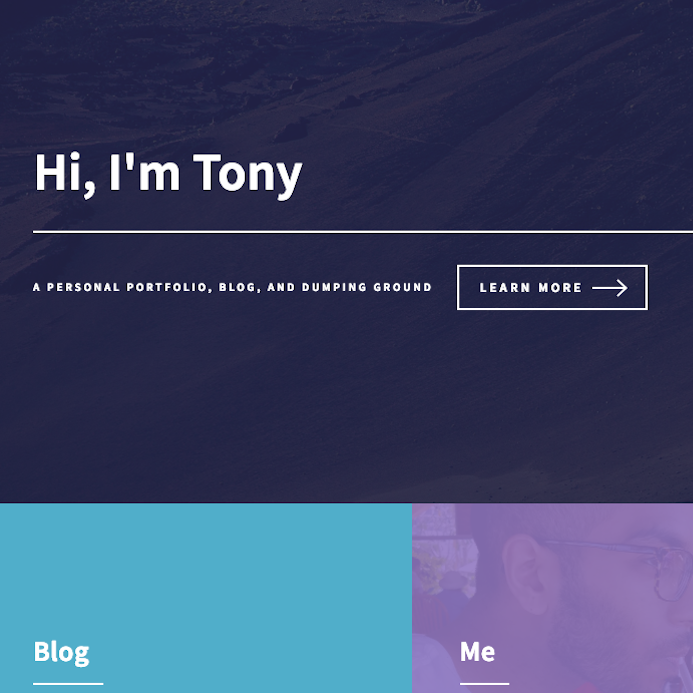
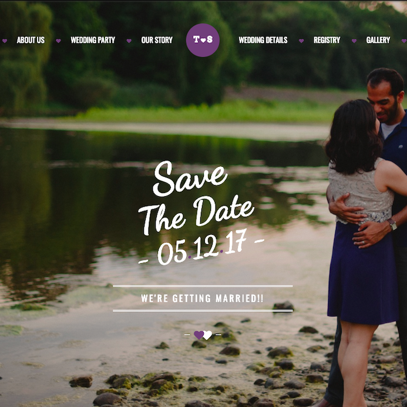
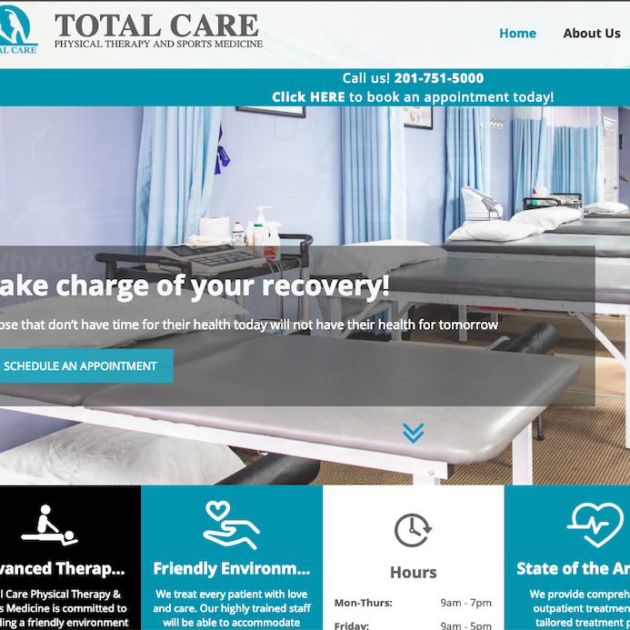
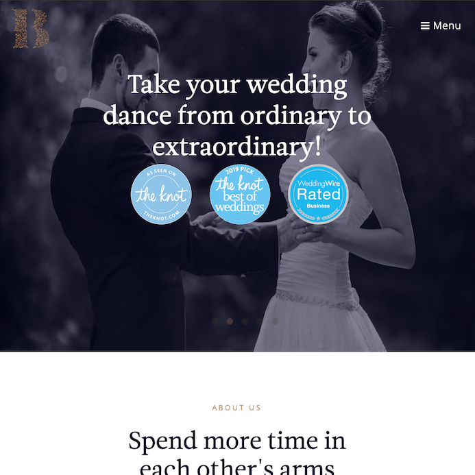
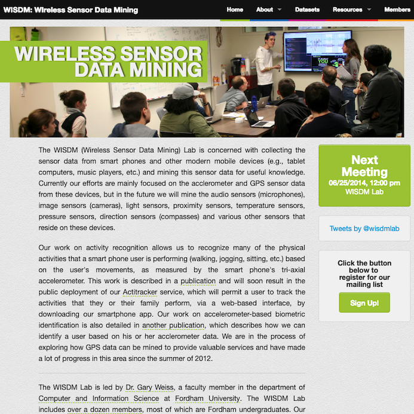

<!-- Main -->

<!-- One -->
<section id="one">
	

		<header class="major">
			<h2>Recent Things I've Done</h2>
		</header>
		
It's hard showing off servers and fancy hardware or software I've coaxed into working so these are just some websites I've worked on recently.

	

</section>

<!-- Two -->
<section id="two" class="spotlights">
	<section>
		
		

			

				<header class="major">
					<h3>This Site!</h3>
				</header>
				
I wanted to use this website to focus on process, not design. I've certainly made prettier sites but I wanted this to be a chance to learn some new skills. This is the first site I've built in VS Code (so far it's been fun) and the first I've made with a CI pipeline yelling at me all the time.

				
I also am using this site to experiment with DB-less content management. I'll link a blog post about that once the process is a bit smoother.

				
Built using Jekyll and the <a href="https://html5up.net/forty">Forty HTML5Up theme</a> ported to Jekyll by <a href="http://andrewbanchi.ch">Andrew Banchich</a>.

			

		

	</section>

	<section>
		
		

			

				<header class="major">
					<h3>My Wedding Website</h3>
				</header>
				
In hindsight, I should have gone with something simpler but instead I spent a lot of time on my wedding website. Thankfully, most of that time was spent writing content. It was my first exposure to CSS preprocessors (SASS) but it was largely a repeat of old habits when I knew no one else would be editing this. This was also my first time using Bootstrap; I had previously only used the Foundation grid framework.

				
Built on a partially rewritten version of the <a href="https://themeforest.net/item/forever-responsive-html-wedding-template/11994338">FOREVER template</a>, written by <a href="https://themeforest.net/user/doubleeight">DoubleEight</a>

			

		

	</section>

	<section>
		
		

			

				<header class="major">
					<h3>Total Care</h3>
				</header>
				
This project for a friend was the first WordPress site that I had to not only host but also manage. I quickly realized that it was one thing to sit on my sysadmin throne and tell devs to do better and quite another to support WordPress properly. At the time, there were about 600 or so WordPress sites sitting on our webservers (across all environments, not just prod). This was definitely a wake-up call for me and was what led to a lot of the changes I pushed for during their migration and upgrades to PHP 7.

				<ul class="actions">
					<li><a href="http://totalcare-pt.com/" class="button">Visit Site</a></li>
				</ul>
			

		

	</section>

	<section>
			
			

				

					<header class="major">
						<h3>Ballroom Boutique</h3>
					</header>
					
Yet another case of asking a friend (our wedding dance instructor) if he needed help with his website. However, it is also the first project where I was not the designer. I stayed somewhat true to the original wireframe but it was in serious need of some mobile optimization. Having to explain the importance of responsive design and the challenges of browser compatability testing to someone who had zero background was a good refresher in perspective.

					
Built using Jekyll and designed in collaboration with <a href="http://www.legasign.com/index.html">LEGASign</a> (although it was mostly her)

					<ul class="actions">
						<li><a href="http://www.ballroomboutique.net" class="button">Visit Site</a></li>
					</ul>
				

			

		</section>

		<section>
				
				

					

						<header class="major">
							<h3>WISDM</h3>
						</header>
						
An old project and the original reason I joined the WISDM research lab back in college. I include this not because it's a great site (although it is still pretty fast) but as a reminder. I was proud then for using a responsive framework (Foundation) and writing fairly clean CSS but, looking back, I added version control very late (and poorly), there was no deployment pipeline, no testing framework, no caching or resource optimization and the list goes on and on. I've learned a lot since then on both the Dev and Ops sides and this site reminds me that there is always more to learn.

						<ul class="actions">
							<li><a href="http://www.cis.fordham.edu/wisdm/" class="button">Visit Site</a></li>
						</ul>
					

				

			</section>

<!-- END Two -->
</section>

<!-- Three -->
<section id="three">
	

		<header class="major">
			<h2>Requests</h2>
		</header>
		
While I do not take on new clients anymore, I am generally willing to serve in a consultative role and provide pro bono IT services and web hosting to non-profits. If you're a small-to-medium non-profit, please reach out!

		<ul class="actions">
			<li><a href="#contact" class="button next scrolly">Get In Touch</a></li>
		</ul>
	

</section>

